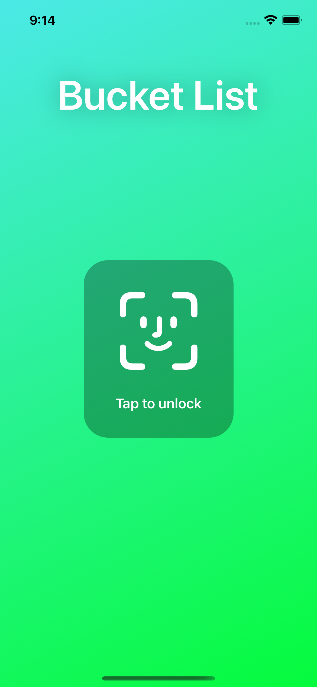
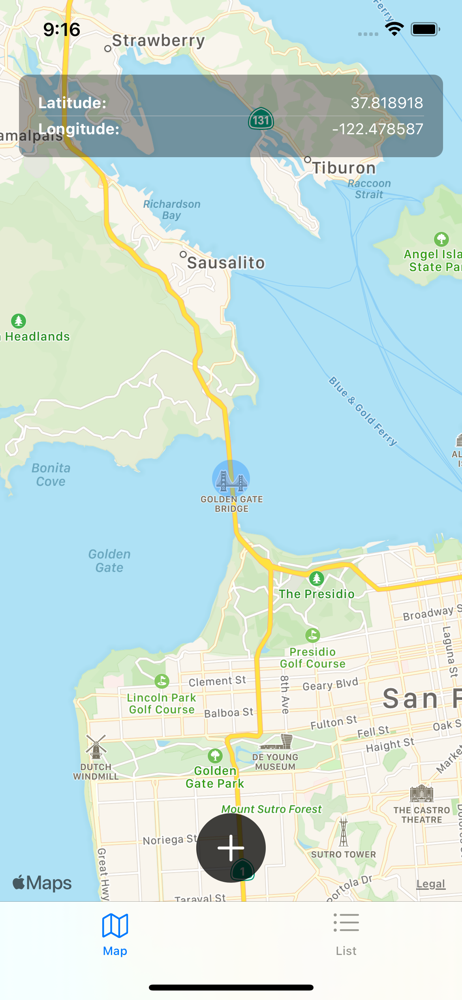
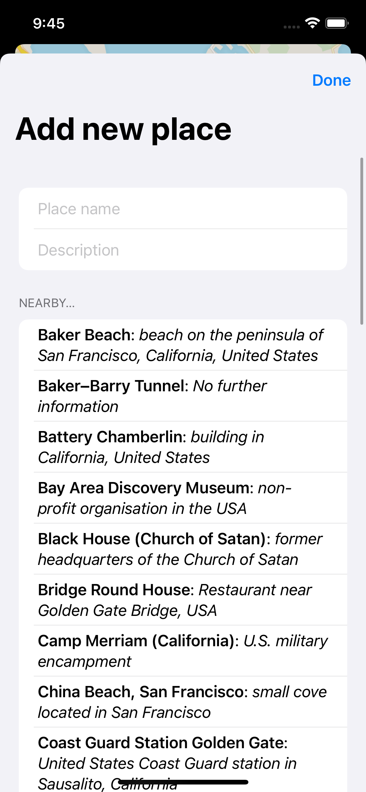
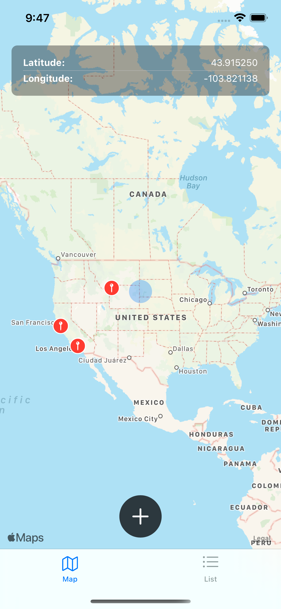
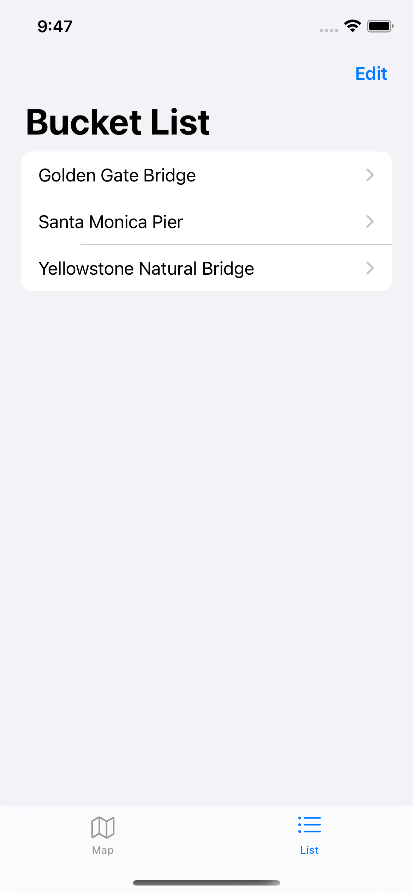

# Bucket-List
14th project of 100 Days of SwiftUI Course by Paul Hudson. This app allows user to add pins on a map. When adding new place, there is list of nearby places from wiki API, so you can tap on it and the name and description fields will be filled with this information. You can edit pins, or see them in a list.

    
